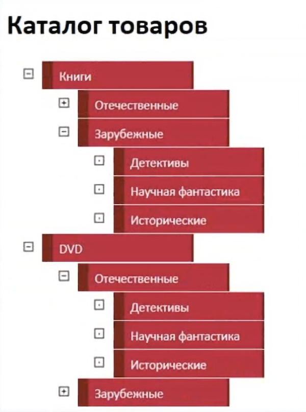

## Product catalogue

Do you buy products in online stores? On such stores' websites, you can often find a drop-down product catalogue on the left. At the heart of the catalogue there are sections with products, which are divided into narrower groups. Finally, if the product groups are not divided into even smaller groups, we can stumble upon a particular product and follow the link to the product page.

Today you're going to have to create a product catalogue.
Example of a catalogue

### Release 0

Markup the catalogue with lists and nested lists. The nesting level can be any. Refer to the picture above, but you can implement your own styles. To illustrate, you can open any online store and take some product categories from there.

### Release 1

Now use CSS to "flip" the catalogue, leaving only the main product sections (the top level of the list) visible

### Release 2

Spice up the catalogue with some JavaScript code. When you click on a list item `<li>` if it has a child item (a nested list) - expand the list, otherwise, if the product group can no longer be expanded, show the final product (a link to the product, which leads you to the product page).